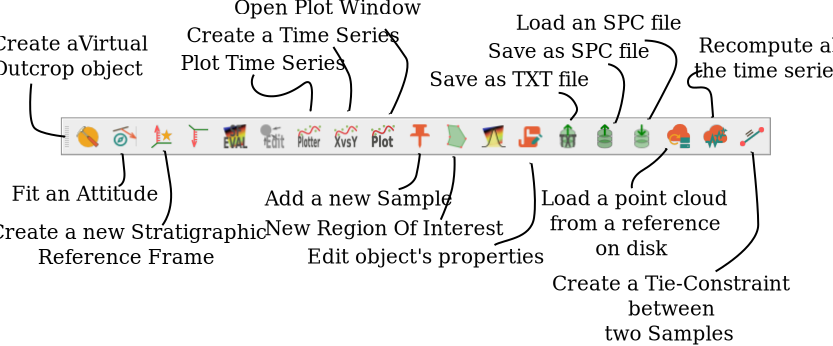

# Basics of Vombat

Vombat is a toolbar for CloudCompare that looks more or less like this one  (might change depending on the specific revision):

each icon represent a specific function of the plugin. 
Basic knowledge of CloudCompare (CC) is required, given the plugin works in a similar manner. You select any object in the DBTree window of CC and the available tools for that specific selection will be colored. Unavailable tools are instead grayed out.

Each tool perform a specific operation on the selected object. Some of them, once activated, will present a further dialog, in which the options can be configured.

---
## Tools

Here is a description of the tools implemented in Vombat

### Attitude Fitting

The tool compute the best fitting attitude for any selected set of points. When multiple sets of points are selected Vombat will output a new Attitude object for each selected point cloud. Optionally it allows to compute a _fixed normal_ attitude for all the selected point clouds.

This is useful when computing multiple attitudes which must have the same orientation in space, although they are located in different parts of the outcrop, e.g. plane parallel stratification or sets of joints.

To operate the tool:

- chose one or more point clouds representing bedding planes or any other planar feature. You can use points laying on the bedding plane itself or traces (produced with the polyline tracing tool or with the qCompass plugin) representing the intersection of the bedding with the topography.
- click on the _Fit an attitutde_ tool. the specify if you want to keep fixed the normal for all the attitudes to be fitted or if each will have an independent normal.
- it will generate an attitude for each selected cloud. If you selected the *Unique Normal* option all the attitudes will have the same orientation, but they will be placed at different locations.

### Stratigraphic Reference Frames (SRF)

A SRF is basically a ruler in the 3D window of CloudCompare, which can be used to measure distances in a specific direction.

It is defined by this simple numerical model:

  $$a^2 + b^2 = c^2$$ 
 
 
 Let's test some inline math $x$, $y$, $x_1$, 
 
 $y_1$.
